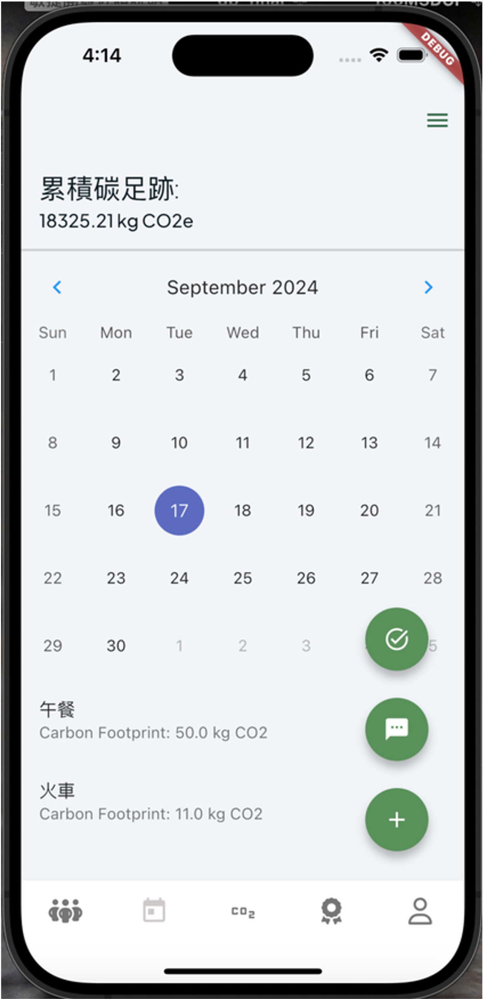
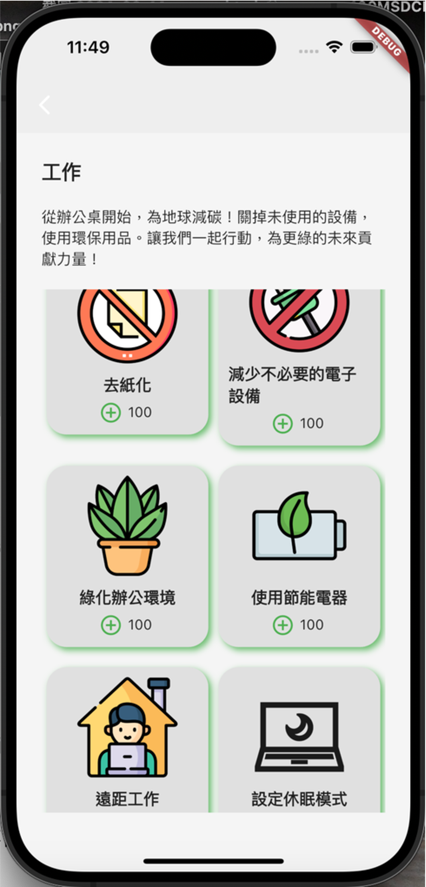
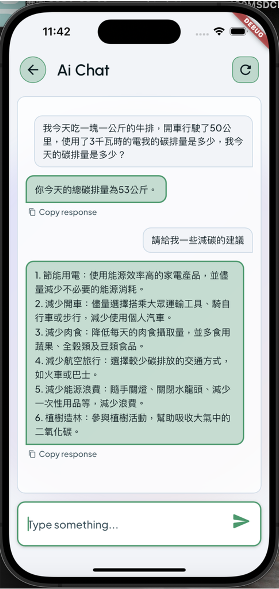
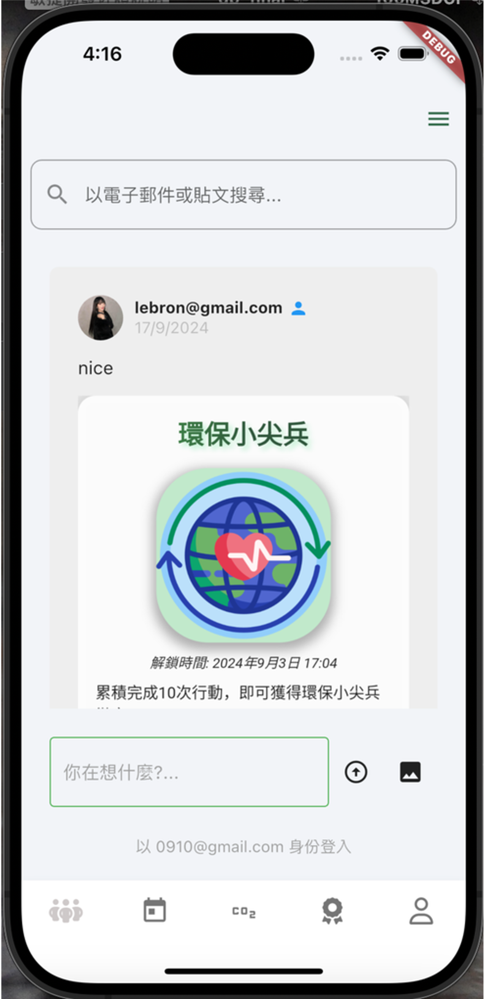

<div align="center">

# 🌱 Carbon-Calculation

**A cross-platform carbon calculator that turns "I should cut my emissions" into a daily habit.**

Log your daily CO₂e in seconds, work through guided low-carbon actions, earn badges, and ask a built-in AI assistant for tips — built with Flutter + Firebase for iOS and web.


**English** | [繁體中文](README.zh-TW.md)

<table>
  <tr>
    <td align="center"><br><sub>Home</sub></td>
    <td align="center"><br><sub>Actions</sub></td>
    <td align="center"><br><sub>AI Chat</sub></td>
    <td align="center"><br><sub>Social</sub></td>
  </tr>
</table>

</div>

---

## 📖 About The Project

Most people want to lower their carbon footprint but have no easy way to measure it — looking up emission factors by hand is tedious, so they never start.

Carbon-Calculation removes that friction. Five tabs — **Social, Home, Actions, Achievement, Profile** — take you from *measuring* your footprint to *reducing* it: log activities, watch your CO₂e on a calendar, and work through curated actions across diet, home, office, and outdoor. The AI assistant turns plain language into an emissions estimate, while badges and a leaderboard keep the habit going.

### Key Features

- **Carbon calculator** — estimate personal CO₂e and visualise it with `fl_chart` / Syncfusion charts.
- **Guided actions** — diet / home / office / outdoor categories, each with lists, tiles, and detail views.
- **AI assistant** — in-app chat powered by a fine-tuned OpenAI GPT-3.5 model.
- **Gamification** — badges, achievements, a points shop, and coupons.
- **Social feed** — posts, likes, comments, friends, and a carbon leaderboard.
- **Multi-provider auth** — email, Google, Apple, GitHub, and anonymous sign-in via Firebase Auth.
- **Admin console** — dashboard, member management, post moderation, and shop management.
- **Cross-platform** — one Flutter codebase shipping to iOS and the web.

---

## 👤 My Role

> Final-year university capstone · team of 5

I owned these modules end-to-end:

- **Authentication** (`lib/auth`, `lib/login`) — multi-provider sign-in: email, Google, Apple, GitHub, and anonymous, via Firebase Auth.
- **Home calendar** (`lib/pages/home`) — the daily calendar that logs and tallies each day's CO₂e.
- **Carbon calculator** (`lib/pages/calculator`) — the simple footprint calculator.
- **Rewards** (`lib/personalpage/shop`, `lib/flutter_flow/coupon_page.dart`) — the points shop and coupon system.

---

## 💡 Why It Helps

- **Log in seconds, not spreadsheets** — tell the AI assistant *"drove 50 km, ate 1 kg of beef, used 3 kWh"* and get your CO₂e back instantly, with no emission-factor lookup.
- **One-tap actions** — four curated categories turn "cut my carbon" into concrete, loggable steps.
- **See your trend** — a calendar view tracks daily CO₂e, so progress and spikes are clear at a glance.
- **Stay motivated** — badges, achievements, and a friends leaderboard keep the habit going.

---

## 🛠 Built With

**Flutter** (Dart 3) · **Firebase** (Auth · Firestore · Storage · Cloud Functions) · **OpenAI** GPT-3.5 (fine-tuned) · built with **FlutterFlow** · `go_router` · `provider` · `fl_chart` / Syncfusion charts.

---

## 🏗 Architecture

The Flutter client (iOS + web) uses Firebase for authentication, data (Firestore), and file storage. AI requests never call OpenAI directly: the app sends the user's Firebase ID token to a Cloud Function (`chatCompletion`), which verifies it and proxies the request with a server-side key — so no API secret ships inside the client.

```
Flutter app  ──►  Firebase Auth / Firestore / Storage
     │
     └── Firebase ID token ──►  Cloud Function (chatCompletion)  ──►  OpenAI API
                                  verifies token, injects key
```

---

## 📂 Project Structure

```
CO2e/
├── lib/
│   ├── main.dart                 # app entry, Firebase init, root nav
│   ├── auth/                     # Firebase auth (email/google/apple/github/anon)
│   ├── backend/                  # Firestore schema, Storage, API calls
│   ├── pages/                    # core feature screens
│   │   ├── home/  social/  achievement/  calculator/
│   │   ├── action/               # actions + diet/house/office/outdoor options
│   │   └── badge/                # badges & unlock flow
│   ├── chatgpt/                  # in-app AI assistant
│   ├── admin_home/               # admin dashboard / members / posts / shop
│   ├── personalpage/             # profile, edit, friends, shop, help
│   └── flutter_flow/             # FlutterFlow theme, widgets, nav, shop/cart
├── firebase/                     # Firestore rules/indexes, Storage rules, Functions
│   └── functions/                # onUserDeleted + chatCompletion (OpenAI proxy)
├── ios/   ·   web/   ·   test/
└── pubspec.yaml
```

---

## 📫 Contact

**poweichen00** — [GitHub](https://github.com/poweichen00) · [Project repository](https://github.com/poweichen00/Carbon-Calculation)

---

## 📄 License

Released under the [MIT License](LICENSE). Carbon-emission factors and third-party icon assets retain their original licenses.
